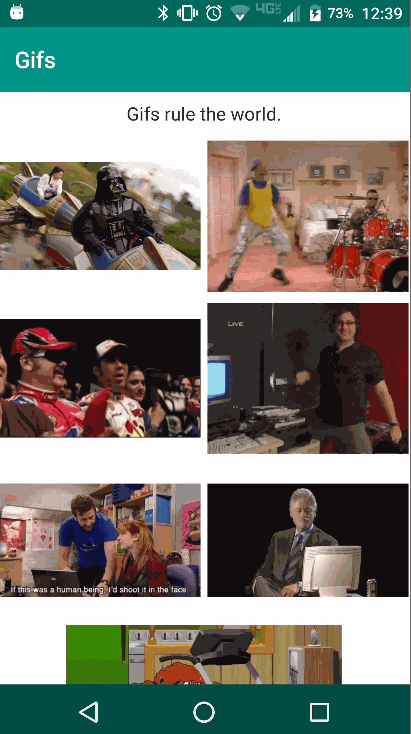

[](https://www.npmjs.com/package/nativescript-gif)
[](https://www.npmjs.com/package/nativescript-gif)

# NativeScript-Gif
NativeScript plugin to use .gifs

Android Library | iOS CocoaPod
--------------- | ------------
[Koral-- / android-gif-drawable](https://github.com/koral--/android-gif-drawable) | [FLAnimatedImage by Flipboard](https://github.com/Flipboard/FLAnimatedImage)

## Installation
#### NS 3.0 +
`tns plugin add nativescript-gif`

#### NS < 3.0
`tns plugin add nativescript-gif@1.0.9`

Android Screen | iOS Screen
-------------- | ----------
 | 

## Usage
#### XML

<span style="color:red">IMPORTANT: </span>*Make sure you include
`xmlns:Gif="nativescript-gif"` on the Page element.*

```XML
<Page xmlns="http://schemas.nativescript.org/tns.xsd"
      xmlns:Gif="nativescript-gif" loaded="pageLoaded">
  <StackLayout>
    <Gif:Gif headers="{{headersJSON}}" src="~/gifs/bill.gif" height="100" />
    <Gif:Gif src="https://media4.giphy.com/media/3uyIgVxP1qAjS/200.gif" height="200" />
  </StackLayout> 
</Page>  
```
#### Angular 2
##### TypeScript

`import { registerElement } from "nativescript-angular/element-registry";`

`registerElement("Gif", () => require("nativescript-gif").Gif);`

##### HTML 
```HTML
<StackLayout>
    <Gif [headers]="headersJSON" src="~/gifs/bill.gif" height="100" ></Gif>
    <Gif src="https://media4.giphy.com/media/3uyIgVxP1qAjS/200.gif" height="200" ></Gif>
</StackLayout>
```

## Properties
- **src** - *required*
Set the gif file to play.

- **headers - (JSON Object)** - *optional*
Set headers to add when loading a gif from URL

## API

##### start()
- starts playing the .gif

##### stop()
- stops playing the .gif

##### getFrameCount()
- returns the number of frames in the current .gif

##### isPlaying()
- returns boolean value indicating if the gif is playing.

***

###### *Android Only*

##### getDuration()
- returns the .gif duration

##### reset()
- resets the .gif to its initial frame

##### setSpeed(speedFactor: *Number*)
- sets the .gif play speed

##### recycle()
- provided to speed up freeing memory <small>*advanced usage - you shouldn't need this often*</small>

#### Contributors
- [NathanaelA](https://github.com/NathanaelA) - [@CongoCart](https://twitter.com/CongoCart)
- [NathanWalker](https://github.com/NathanWalker) - [@wwwalkerrun](https://twitter.com/wwwalkerrun)
